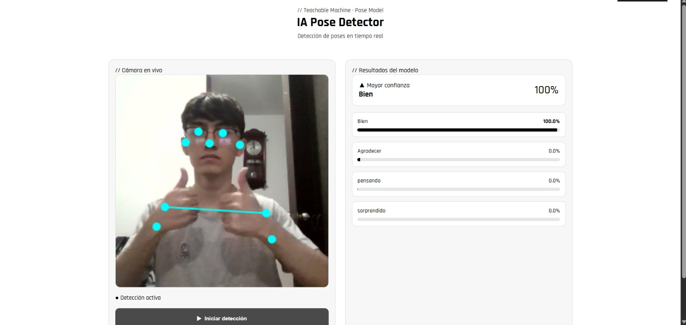
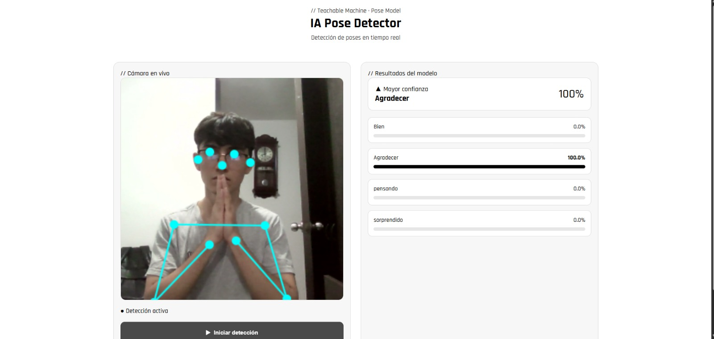
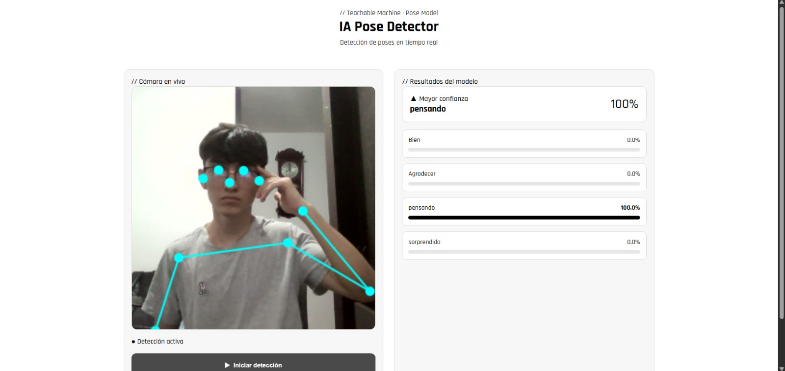
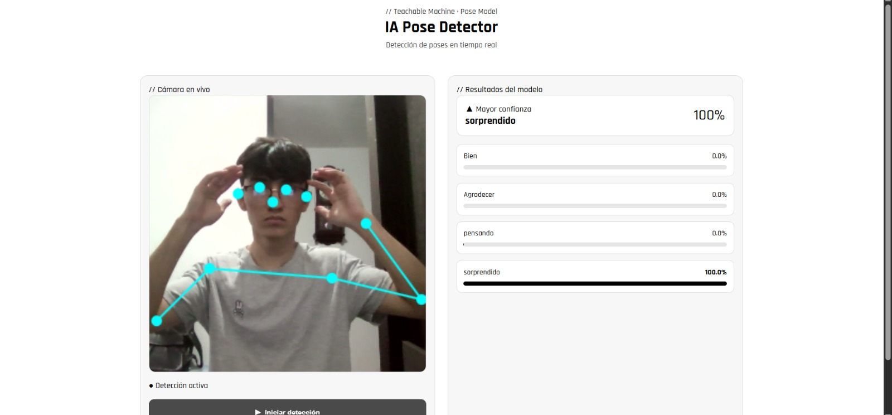

# IA Pose Detector

Este repositorio contiene una pagina web de detección de poses en tiempo real construida con `TensorFlow.js` y `Teachable Machine Pose`. El proyecto utiliza la cámara del dispositivo para estimar la postura de la persona usuaria, comparar esa información contra un modelo previamente entrenado y mostrar en pantalla la clase detectada con su nivel de confianza.

La pagina web fue diseñada como una experiencia simple, visual y directa: la cámara aparece en un panel principal, el esqueleto corporal se dibuja en tiempo real sobre la imagen, y en un panel lateral se presentan las probabilidades de cada pose reconocida por el modelo.

## Vista general

La solución corre completamente en el navegador. No hay procesamiento en un servidor propio ni un backend que reciba imágenes. El flujo principal ocurre en el cliente:

1. La aplicación carga el modelo exportado desde Teachable Machine.
2. Se solicita acceso a la cámara.
3. TensorFlow.js procesa cada fotograma.
4. Se estima la pose corporal.
5. El modelo clasifica la pose detectada.
6. La interfaz actualiza la clase dominante y las probabilidades en tiempo real.

## Capturas del proyecto

### Detección de la pose "Bien"



### Detección de la pose "Agradecer"



### Detección de la pose "Pensando"



### Detección de la pose "Sorprendido"



## ¿Qué hace esta pagina web?

Esta pagina web reconoce poses humanas asociadas a gestos o expresiones representadas como "emojis de pose". A partir de la postura del cuerpo y la ubicación de puntos clave, el modelo clasifica cuál de las poses entrenadas está realizando la persona frente a la cámara.

En la versión actual, la interfaz muestra cuatro clases principales:

- `Bien`
- `Agradecer`
- `pensando`
- `sorprendido`

Cada predicción se representa con:

- una etiqueta con el nombre de la clase,
- una barra de probabilidad,
- el porcentaje de confianza,
- y una tarjeta destacada con la clase más probable en ese instante.

## ¿Cómo funciona?

La aplicación se apoya en la librería `@teachablemachine/pose`, que internamente utiliza técnicas de estimación corporal para detectar puntos clave del cuerpo humano. A partir de esos puntos, el modelo entrenado decide a cuál clase corresponde la pose observada.

El flujo técnico es el siguiente:

### 1. Carga del modelo

En `app.js` se define la URL pública del modelo entrenado:

```js
const MODEL_URL = "https://teachablemachine.withgoogle.com/models/dyyi3qHP7/";
```

Desde esa ruta se cargan:

- `model.json`
- `metadata.json`

Esto permite conocer tanto la arquitectura exportada como las clases del modelo.

### 2. Activación de la webcam

Cuando la persona presiona el botón de inicio, la aplicación:

- solicita permisos de cámara,
- crea una webcam en modo espejo,
- prepara el `canvas`,
- y activa el estado visual de detección.

### 3. Estimación de pose

En cada fotograma, el modelo ejecuta:

```js
const { pose, posenetOutput } = await model.estimatePose(webcam.canvas);
```

Con esto obtiene:

- la pose estimada,
- los puntos clave del cuerpo,
- y la salida intermedia necesaria para clasificar la pose.

### 4. Clasificación

Luego se calcula la predicción de cada clase:

```js
const predictions = await model.predict(posenetOutput);
```

Después, el sistema identifica la clase con mayor probabilidad y actualiza la interfaz en tiempo real.

### 5. Visualización

La aplicación dibuja sobre el `canvas`:

- la imagen de la webcam,
- los keypoints del cuerpo,
- y el esqueleto de la pose.

Al mismo tiempo, actualiza:

- el estado del sistema,
- la tarjeta de mayor confianza,
- y las barras de probabilidad de cada clase.

## Estructura del proyecto

El repositorio es intencionalmente simple y está organizado en pocos archivos:

```text
POSE-PAGE-PROJECT-ML/
├── index.html
├── style.css
├── app.js
├── README.md
└── readme_img/
```

### `index.html`

Contiene la estructura principal de la aplicación:

- encabezado del proyecto,
- panel de cámara,
- panel de resultados,
- botón para iniciar detección,
- contenedores para estado, clase dominante y barras de probabilidad.

También importa:

- `TensorFlow.js`,
- `Teachable Machine Pose`,
- tipografías de Google Fonts,
- y los estilos del proyecto.

### `style.css`

Define la apariencia visual de la interfaz:

- layout en dos columnas,
- paneles con fondo claro,
- área de cámara cuadrada,
- tarjetas de resultados,
- barras de progreso,
- y comportamiento responsive para pantallas más pequeñas.

### `app.js`

Implementa la lógica principal del sistema:

- carga del modelo,
- inicialización de la webcam,
- creación dinámica de barras de resultados,
- bucle de predicción,
- detección de la clase dominante,
- render de la pose sobre el `canvas`,
- y actualización de estados visuales.

## Tecnologías utilizadas

Este proyecto fue construido con herramientas del lado del cliente, sin framework frontend adicional.

- `HTML5`
- `CSS3`
- `JavaScript`
- `TensorFlow.js`
- `Teachable Machine Pose`

## Características principales

- Detección de poses en tiempo real desde la cámara.
- Clasificación basada en un modelo entrenado previamente.
- Visualización del esqueleto corporal sobre la imagen.
- Indicador de estado de carga y detección activa.
- Interfaz limpia con foco en lectura rápida de resultados.
- Renderizado en navegador, sin backend propio.
- Adaptación básica a pantallas móviles o estrechas.

## Ventajas del enfoque

### Ejecución local en el navegador

Una de las principales ventajas del proyecto es que el procesamiento ocurre del lado del cliente. Eso reduce la complejidad de despliegue y evita depender de un servidor para inferencia en tiempo real.

### Interacción inmediata

La detección se actualiza frame a frame, lo que permite una experiencia interactiva, útil para demostraciones, pruebas de modelos y presentaciones académicas.

### Arquitectura simple

Al no depender de un backend ni de un proceso de compilación, la pagina es fácil de entender, mantener y extender.

## Privacidad

La aplicación usa la cámara del dispositivo para realizar la detección de poses. En la implementación actual, el análisis se hace en el navegador de la persona usuaria usando TensorFlow.js y el modelo cargado desde Teachable Machine.

Eso significa que:

- la cámara se procesa localmente en la página,
- no existe en este repositorio un servidor que reciba imágenes,
- y la inferencia sucede directamente en el cliente.

De todos modos, la pagina depende de recursos externos cargados por URL, como el modelo y algunas librerías CDN. Si en una siguiente versión se quiere mayor control del entorno, conviene alojar esos archivos dentro del propio proyecto o en una infraestructura administrada por el equipo.

## Requisitos para usar la página web

Para utilizar la página se necesita:

- un navegador moderno,
- permisos para acceder a la cámara,
- conexión a internet para cargar las librerías CDN y el modelo remoto.

## Uso de la página web

La pagina  está pensada para abrirse como una experiencia web simple e interactiva. La persona usuaria solo debe ingresar a la página, activar la cámara y comenzar a realizar las poses entrenadas para ver la clasificación en tiempo real.

## Flujo de uso en la página

1. Abrir la aplicación en el navegador.
2. Presionar `Iniciar detección`.
3. Aceptar los permisos de cámara.
4. Ubicarse frente a la cámara y realizar una de las poses entrenadas.
5. Observar la clase con mayor confianza y el comportamiento de las demás probabilidades.

## Posibles mejoras futuras en la Pagina

Este proyecto puede crecer en varias direcciones:

- agregar más clases de poses,
- mejorar el dataset de entrenamiento,
- aumentar la robustez frente a iluminación o encuadres distintos,
- incluir umbrales mínimos para validar predicciones,
- mostrar historial de predicciones,
- añadir retroalimentación sonora o visual,
- exportar estadísticas de uso,
- y permitir cambiar entre cámara frontal y trasera en dispositivos móviles.

## Limitaciones actuales

- La precisión depende directamente de la calidad del entrenamiento realizado en Teachable Machine.
- El comportamiento puede variar según iluminación, distancia a cámara y fondo.
- El proyecto depende de un modelo remoto alojado fuera del repositorio.
- Las versiones de `TensorFlow.js` y `@teachablemachine/pose` se cargan desde CDN y pueden requerir actualización en el tiempo.
- No hay persistencia de datos ni almacenamiento de sesiones.

## Contexto académico y técnico

Este tipo de implementación es especialmente útil para:

- prototipos de visión por computadora,
- demostraciones educativas de machine learning en navegador,
- ejercicios de interacción humano-computador,
- proyectos de clase orientados a IA aplicada,
- y pruebas rápidas de clasificación de poses sin infraestructura compleja.

## Créditos

Este proyecto fue posible gracias a:

- `Teachable Machine`, por facilitar el entrenamiento y exportación del modelo de poses.
- `TensorFlow.js`, por permitir inferencia de modelos directamente en el navegador.
- `@teachablemachine/pose`, por integrar el flujo de estimación y clasificación de poses de forma accesible.

## Estado del proyecto

El repositorio corresponde a una implementación funcional de detección de poses en tiempo real con una interfaz web clara y una integración directa con un modelo exportado desde Teachable Machine.

Como base de proyecto, cumple bien para demostración, validación de concepto y extensión futura hacia una versión más robusta.

## Desarrolladores
* Diego Barrios
* Ronald Pradilla
* Richard Montes
